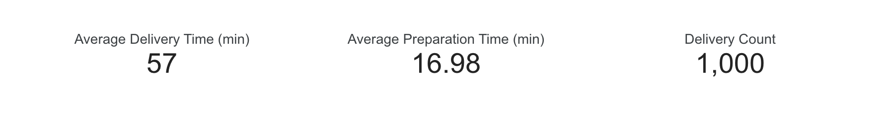
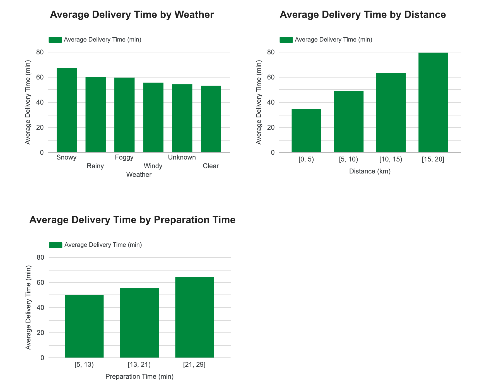

## 📌 Food Delivery Time Analysis Dashboard
Exploring internal, external, and logistical factors that impact delivery time using Python, SQL, and Looker Studio

## 📈 1. Project Overview
This project analyzes food delivery time data to identify patterns associated with delivery performance.

Using: 
- **Python (Pandas)** for data exploration and cleaning
- **SQL** for validating key drivers identified during EDA
- **Looker Studio** for interactive visualization
- **Kaggle Notebook** for code and documentation

The goal is to answer key questions related to food delivery time, such as:
-  How do weather conditions impact average delivery time?  
-  How does delivery distance affect delivery time?
-  How are preparation times associated with overall delivery times?

## 📊 2. Dataset
- **Columns**: 9
- **Rows**: 1,000
- **Missing Values**: 
**Weather**: 30 rows 
**Traffic_Level**: 30 rows 
**Time_of_Day**: 30 rows 
**Courier_Experience_yrs**: 30 rows

## 🧹 3. Data cleaning
- Filled missing numeric values with median and categorical values with "Unknown."
- Converted the data type of Courier_Experience_yrs to integer.

## 🔍 4. Exploratory Data Analysis
- Most deliveries occur during clear weather.
- Traffic density is mostly medium, followed by low.
- Average delivery time is around 57 minutes.
- Distance ranges from 0.59 km to 19.99 km.

These exploratory observations provide context for identifying the key drivers of delivery time, which are further analyzed through KPIs, SQL, and the dashboard.

## 🧠 5. Key performance indicators
- **1. Delivery Time**:
Measures the overall average delivery time across all orders.
- **2. Delivery Time by Weather**:
Measures how different weather conditions impact average delivery time.
- **3. Delivery Time by Traffic Level**:
Measures how traffic density affects average delivery time.
- **4. Delivery Time by Distance**:
Measures average delivery time across four distance categories.
- **5. Delivery Time by Preparation Time**:
Measures how restaurant preparation time influences average delivery time.

## 🔍 6. SQL Analysis
### Why SQL is used
- To validate three key drivers: weather, traffic levels, and delivery counts across distance categories.
### What this section validates
- Weather conditions and traffic levels significantly increase average delivery time.
- Delivery times are distributed across distance categories with slightly higher volumes in longer distance groups.

## 🧾 7. Dashboard Overview
This dashboard is designed to identify the key drivers that impact delivery time. 
It helps delivery managers focus on actions to reduce delivery time by addressing the most influential drivers.
### Dashboard Overview
**Executive Summary** 
Preparation Time has the strongest contorollable impact on delivery delays.
**Recommendation:** Monitor and optimize restaurant preparation during peak hours.

### Key Delivery Time Drivers
Delivery time increases with worse weather, longer distance, adn longer preparation time.

### Interactive Filters
Users can filter delivery performance by traffic level to explore how conditions affect delivery time.

## 💡 8. Key Insights
- **Insight 1**: Weather conditions and traffic levels significantly increase average delivery time.
- **Insight 2**: Average delivery time increases as the delivery distance becomes longer.
- **Insight 3**: Longer preparation times are associated with higher overall delivery times.

## 🧰 9. Tools & Technologies
- **Python**
- **SQLite**
- **SQL**
- **Google Looker Studio**
- **GitHub Repository**

## 🚀 10. Next Step
- Build additional data analysis projects to further strengthen my portfolio.

👨‍💻 *Created by: Ryuho Kajiyama
📍 Netherlands | 📧 Kumagorou.ryuho@gmail.com | 🔗 [GitHub: https://github.com/ryuho-kajiyama / LinkedIn: https://www.linkedin.com/in/ryuho-kajiyama-979205362/]

