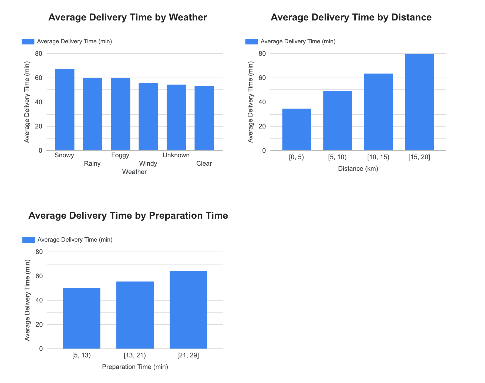
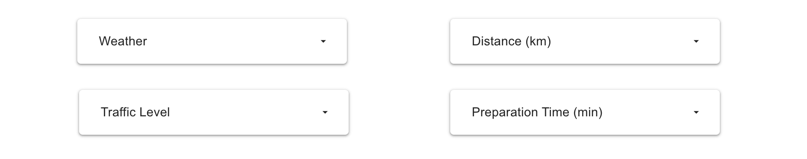

## 📌 Food Delivery Time Analysis Dashboard
Exploring internal, external, and logistic factors that impact delivery time using Python, SQL, and Looker Studio

## 📈 1. Project Overview
This project analyzes food delivery time data to identify the patterns associated with food delivery time.

Using:\
- **Python (Pandas)** for data exploration and cleaning
- **SQL** for validating key drivers identified during EDA
- **Looker Studio** for interactive visualization
- **Kaggle Notebook** for code and documentation

The goal is to answer kew questions related to food delivery time, such as:
-  How do weather conditions impact average delivery time?  
-  How does delivery distance affect delivery time?
-  How are preparation times associated with overall delivery times?

## 📊 2. Dataset
- **column**: 9
- **row**: 1,000
- **Missing Values**:\
**Weather column**: 30 rows\
**Traffic_Level column**: 30 rows\
**Time_of_Day column**: 30 rows\
**Courier_Experience_yrs column**: 30 rows

## 🧹 3. Data cleaning
- Filled missing numeric valuews with median and categorical valuews with "Unknown."
- Converted data type in Courier_Experience_yrs into integer.

## 🔍 4. Exploratory Data Analysis
- Most delivers occur during clear weather.
- Traffic density is mostly 'Medium', followed by 'Low'.
- Average delivery time is around 57 minutes.
- Distance ranges from 0.59 km to 19.99 km.

## 🧠 5. Key performance indicators
- **1. Delivery Time**:
Measures the overall average delivery time across all orders.
- **2. Delivery Time by Weather**:
Measures how different weather conditions imapct average delivery time.
- **3. Delivery Time by Traffic Level**:
Measures how traffic density affects average delivery time.
- **4. Delivery Time by Distance**:
Measures average delivery time across four distance categories.
- **5. Delivery Time by Preparation Time**:
Measures how restaurant preparation time influences average delivery time.

## 🔍 6. SQL Analysis
### Why SQL is used
- To validate three key drivers: Average delivery time by Weather, traffic, and delivery counts across different delivery distance categories.
### What this section validates
- Weather conditions and traffic levels significantly increase average delivery time.
- Delivery times are contributed across different delivery distance categories with slightly higher volumes in longer distance groups.

## 🧾 7. Dashboard Overview
This dashboard is to identify key drivers that impact delivery time. 
It will help delivery managers focus on actions to reduce delivery time by addressing the most influential drivers.
### Dashboard Overview

### Key Delivery Time Drivers

### Interactive Filters

## 💡 8. Key Insights
- **Insight 1**: Weather conditions and traffic levels significantly increase average delivery time.
- **Insight 2**: Average delivery time increases as the delivery distance becomes longer.
- **Insight 3**: Longer preparation times are associated with higher overall delivery times.

## 🧰 9. Tools & Technologies
- **Python**
- **SQL**
- **Google Looker Studio**
- **GitHub Repositry**

## 🚀 10. Next Step
- I plan to build a new project at the end of this year.
